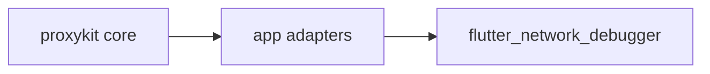

# proxykit

[](https://pkg.go.dev/github.com/777genius/proxykit)
[](https://github.com/777genius/proxykit/releases/latest)
[](https://github.com/777genius/proxykit/actions/workflows/ci.yml)
[](https://github.com/777genius/proxykit/actions/workflows/docs.yml)
[](https://777genius.github.io/proxykit/)
[](https://github.com/777genius/proxykit/discussions)

`proxykit` is a standalone Go proxy foundation for applications that need:

- reverse HTTP proxying
- forward HTTP proxying
- CONNECT tunneling
- WebSocket proxying
- listener lifecycle management
- neutral transport observation hooks

It is intentionally **not** a product backend, API server, or gateway control plane.

## Why not `goproxy`, `oxy`, or `Martian`?

Those projects are real and useful, but they optimize for different shapes:

- `goproxy` is a mature programmable HTTP/HTTPS proxy with a more monolithic center
- `oxy` is strongest as an HTTP reverse-proxy and middleware toolkit
- `Martian` is excellent when you want a deeper modifier-driven HTTP testing proxy

Choose `proxykit` when your application needs one embeddable foundation for `reverse + forward + CONNECT + WebSocket`, while keeping routes, storage, admin APIs, and UI-facing contracts in your own adapter layer.

## Capability map

| Need | Package |
| --- | --- |
| mounted reverse proxy route | `reverse` |
| absolute-URI forward proxy | `forward` |
| plain CONNECT tunneling | `connect` |
| WebSocket proxying | `wsproxy` |
| transport-neutral hooks | `observe` |
| forward and SOCKS listener lifecycle | `proxyruntime` |
| cookie rewriting helpers | `cookies` |
| focused transport helpers | `proxyhttp`, `socketio`, `mitm` |

## Quick start

```go
package main

import (
	"log"
	"net/http"

	"github.com/777genius/proxykit/reverse"
)

func main() {
	handler, err := reverse.New(reverse.Options{
		Resolver: reverse.QueryTargetResolver{
			MountPath:     "/proxy",
			DefaultTarget: "https://example.com",
		},
	})
	if err != nil {
		log.Fatal(err)
	}

	mux := http.NewServeMux()
	mux.Handle("/proxy", handler)
	mux.Handle("/proxy/", handler)

	log.Fatal(http.ListenAndServe(":8080", mux))
}
```

## Documentation

- live docs: [777genius.github.io/proxykit](https://777genius.github.io/proxykit/)
- local docs source: [`docs/`](./docs)
- VitePress site entry point: [`docs/index.md`](./docs/index.md)
- design questions and integration discussion: [GitHub Discussions](https://github.com/777genius/proxykit/discussions)

Main docs sections:

- [Getting Started](./docs/guide/getting-started.md)
- [Runnable Examples](./docs/guide/examples.md)
- [Use Cases](./docs/guide/use-cases.md)
- [Package Matrix](./docs/guide/package-matrix.md)
- [Cookbook](./docs/guide/cookbook.md)
- [Architecture](./docs/guide/architecture.md)
- [Packages](./docs/guide/packages.md)
- [Compatibility and Versioning](./docs/guide/compatibility.md)
- [Migration](./docs/guide/migration.md)
- [Limits and Non-Goals](./docs/guide/limits.md)
- [Comparisons](./docs/guide/comparisons.md)
- [FAQ](./docs/guide/faq.md)

## Quick package map

- `reverse` - mounted reverse HTTP proxy handler
- `forward` - absolute-URI HTTP forward proxy handler
- `connect` - plain CONNECT tunnel handler
- `wsproxy` - WebSocket proxy handler
- `proxyruntime` - forward and SOCKS listener lifecycle
- `observe` - transport-neutral hooks and event structs
- `cookies`, `proxyhttp`, `socketio`, `mitm` - focused supporting packages

## Real-world example

`proxykit` already powers a production-style application:

- [`flutter_network_debugger`](https://github.com/cherrypick-agency/flutter_network_debugger) - a Flutter + Go network debugging app built on top of `proxykit` through an application adapter layer

This repo is the reusable transport foundation extracted from that application, not a copy of the whole product backend.



## Design rules

- no UI-specific contracts in public packages
- small packages with explicit boundaries
- application routes, persistence, and delivery protocols stay outside the module
- transport packages expose hooks instead of owning storage or REST DTOs

## Install

```bash
go get github.com/777genius/proxykit@v0.1.7
```

Use the tagged version shown here if `proxy.golang.org` is still catching up and `@latest` briefly lags behind the newest release.

## Why this repo is intentionally smaller than a full backend

`proxykit` is the reusable transport foundation, not a full proxy product backend.

That means the public module intentionally excludes:

- app-specific REST routes
- monitor room protocols
- storage ownership
- UI DTOs and preview payloads
- admin auth and settings APIs

## Build the docs locally

The docs site uses the latest VitePress alpha line from npm.

```bash
npm install
npm run docs:dev
```

## Verification

```bash
go vet ./...
go test ./...
go test -race ./...
npm run docs:build
```

## Contributing

See [CONTRIBUTING.md](./CONTRIBUTING.md) for workflow, architecture guardrails, and review expectations.

For community processes:

- [Code of Conduct](./CODE_OF_CONDUCT.md)
- [Security Policy](./SECURITY.md)
- [Support](./SUPPORT.md)
- [Changelog](./CHANGELOG.md)
- [Releasing](./RELEASING.md)
