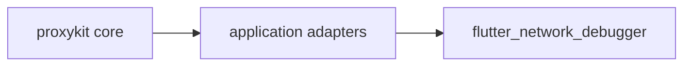

## Why proxykit exists

Most Go proxy projects fall into one of two buckets:

- a powerful but monolithic programmable proxy
- a full platform or gateway product that is hard to embed into your own application

`proxykit` aims for a third shape:

- reusable transport engines
- explicit observation contracts
- your own app remains responsible for persistence, routes, policy, and UI-facing API design

That means the repo is intentionally smaller than a full proxy product backend. It contains the proxy foundation, not your entire application stack.

## Why not `goproxy`, `oxy`, or `Martian`?

- choose [`goproxy`](https://github.com/elazarl/goproxy) when you want a long-standing all-in-one programmable HTTP/HTTPS proxy
- choose [`oxy`](https://github.com/vulcand/oxy) when your center of gravity is reverse-proxy middleware composition
- choose [`Martian`](https://github.com/google/martian) when your main need is deep modifier-driven HTTP testing and mutation

Choose `proxykit` when your application needs one embeddable foundation for reverse HTTP, forward HTTP, CONNECT, and WebSocket, without pushing storage, routes, admin APIs, or UI DTOs into the transport layer.

## What you get

- `reverse` for mounted reverse proxy handlers
- `forward` for absolute-URI HTTP forward proxying
- `connect` for plain CONNECT tunneling
- `wsproxy` for bidirectional WebSocket proxying
- `proxyruntime` for forward and SOCKS listener lifecycle
- `observe` for transport-neutral hooks and event structs
- `cookies`, `proxyhttp`, `socketio`, and `mitm` as focused supporting packages

## Capability map

| Need | Package |
| --- | --- |
| mounted reverse proxy route | `reverse` |
| absolute-URI forward proxy | `forward` |
| plain CONNECT tunneling | `connect` |
| bidirectional WebSocket proxy | `wsproxy` |
| transport-neutral hooks | `observe` |
| listener lifecycle | `proxyruntime` |
| cookie rewriting helpers | `cookies` |
| focused transport helpers | `proxyhttp`, `socketio`, `mitm` |

## Real-world example

`proxykit` is not just a greenfield library extraction. It already powers a real application:

- [`flutter_network_debugger`](https://github.com/cherrypick-agency/flutter_network_debugger) - a Flutter + Go network debugging app that uses `proxykit` as its reusable proxy foundation

That app keeps its own REST routes, storage model, realtime delivery, and UI contracts outside the public `proxykit` surface.

## Start here by scenario

- Building a mounted in-app proxy route: read [Getting Started](/guide/getting-started) and [Cookbook](/guide/cookbook)
- Choosing the right package set: read [Use Cases](/guide/use-cases) and [Package Matrix](/guide/package-matrix)
- Adopting `proxykit` in an existing codebase: read [Migration](/guide/migration)
- Comparing it with older Go proxy libraries: open [Comparisons](/guide/comparisons)

## What stays outside

The following concerns are deliberately **not** part of `proxykit`:

- product-specific REST routes such as `/httpproxy` or `/_api/v1/proxy/config`
- admin auth and loopback security policy
- session query language, pagination, or UI projections
- storage, spool lifecycle, capture visibility, or replay workflows
- monitor rooms, frontend protocols, and product-specific event names

If you need those, build them in your adapter layer on top of the transport packages.
